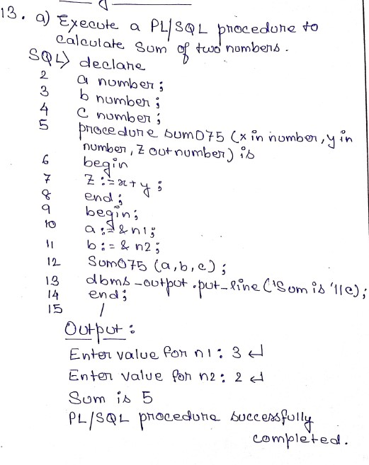
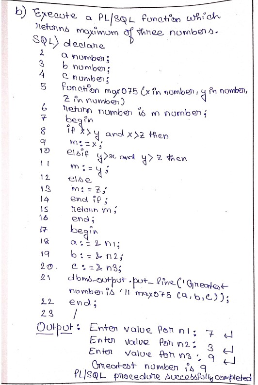
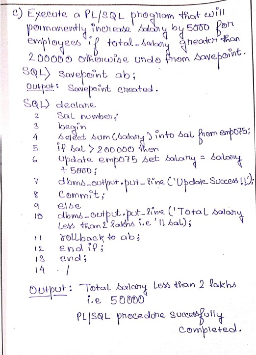

* Modify the data type size of ename to varchar 15
> alter table emp052 modify ename varchar(15);

* Display the user constraints of table EMP052 
> select * from user_constraints where table_name = 'EMP052';

* Add a new column mobileno which is unique (candidate key) of table emp052 
> alter table emp052 add mobileno number(10);

* add the constraint for mobileno which is exactly of 10 digit. 
> alter table emp052 add constraint mob check(mobileno>=1000000000 and mobileno<=9999999999);

* Drop all constraints of mobileno 
> alter table emp052 drop constraints mob;

* Drop the column mobileno of table emp052 
> alter table emp052 drop column mobileno;

* add a new column mgrid representing manager id of datasize varchar 5 and mgrid values should reference from eno of table emp052. 
> alter table emp052 add mgrid varchar(5) add foreign key (mgrid) references emp052 (eno);

* update the table emp052 with following mgrid values 
> update emp052 set mgrid = 'E1' where eno='E1' or eno='E3' or eno='E5';

* Display list of all employees in department no 2 
> select * from emp052 where dno = 2;

* display name and salary of employees in department number 1 and 2 
> select ename, salary from emp052 where dno=1 or dno=2;

* display name of employees having "a" as the second letter in their name 
> select ename from emp052 where ename like '_a%';

* display list of all employees who have name exactly 4 characters. 
> select * from emp052 where ename like '____';

* display employee names and department no for those who joined in the month of june. 
> select ename, dno from emp052 where to_char(joindate,'MON')='JUN';

* display the list of all employees who were joined during 2015 
> select * from emp052 where to_char (joindate, 'YYYY')='2015';

* display the joining date of all employees in dd/mm/yy formate 
> select to_char(joindate,'dd/mm/yy') from emp052;

* display names of all employee in the alphabetic order 
> select ename from emp052 order by ename;

* list the name and the salary of all employee sorted by salary descending order 
> select ename, salary from emp052 order by salary desc;

* list all the employees name whose salary is greater than 7000 and less than 18000 
> select ename from emp052 where salary > 7000 and salary<18000;

* list of all the employees who have salary between 7000 and 18000 
> select * from emp052 where salary >7000 and salary<8000;

* display employee names and department has of all employees who belong to either "chennai", or "kolkata", or "mumbai". 
> select ename, dno from emp052 where city='chennai' or city='kolkata' or city='mumbai';

* display employee names and department has of all employees who belong to either "chennai", or "kolkata" or "mumbai" 
> select ename, dno from emp052 where city='chennai' or city='kolkata' or city='mumbai';

* find the average salary of all employees 
> select avg(salary) from emp052;

* find the difference between highest and lowest salary of employee 
> select max(salary) - min(salary) from emp052;

* display the department no. and no. of employees in each department. 
> select dno, count(eno) from emp052 group by dno;

* display employee no, employee name and salary for employee with lowest salary 
> select eno, ename, salary from emp052 where salary=(select min(salary) from emp052);

* list only the names of all other employees who get the same salary as that of "tamal" 
> select ename from emp052 where salary=(select salary from emp052 where ename='tamal');

* find all department numbers that have more than two employees 
> select dno from emp052 group by dno having count(eno)>2;

* display the names of all employees who engaged in two or more projects 
> select ename from (select * from emp052 natural join project052) group by ename having count(ename)>=2;

* list no. of projects undertaken in the department 1 
> select count(pno) from project052 natural join emp052 where dno=1;

* display name and salary for all employees who are engaged with at least one project. 
> select ename, salary from emp052, project052 where emp052.eno=project052.eno;

* display employee names and department names of all employees who belong to either "chennai", or "kolkata" or "mumbai" 
> select ename, dname from emp052 natural join dept052 where city='chennai' or city='kolkata' or city='mumbai';

* display employee name who get the highest salary 
> select ename from emp052 where salary=(select max(salary) from emp052);

* display employee name who get the 2nd highest salary 
> select ename from emp052 where salary = (select max(salary) from emp052 where salary<(select max(salary) from emp052));

*  display department number having most number of employees.
> select dno from emp052 group by dno having count(dno)=(select max(count(dno)) from emp052 group by dno);

* display employee name along with their manager name using self-join concept.
> select a.ename, b.ename as management from emp052 a, emp952 b where b.eno = a.mgrid;

* display employee name along with their department name using natural join and inner join.
> select ename, dname from emp052 natural join dept052;
>select ename, dname from emp052 inner join dept052 on emp052.dno=dept052.dno;

-- note 11

* Execute a PL/SQL program to calculate factorial of a given number.
> declare
> fact number := 1;
> n number := &no;
> begin
> while n>0 loop
> fact := n*fact;
> n := n-1;
> end loop;
> dbms_output.put_line(fact);
> end;
> /

* Execute a pl/sql program to calculate area of a circle of a value of radius from 3 to 7 and insert the radius and the corresponding values of calculated areas in table circle(radius,area).
> create table circle052(radius number(5), area double precision);

> declare
> r number(2);
> area double precision := 0.0;
> begin
> for r in 3..7 loop
> area:=3.14 * r * r;
> dbms_output.put_line(area):
> insert into circle052 values(r,area);
> end loop;
> end;
> /

* add an extra column circumference to the table circle and execute another pl/sql program to update the calculate circumference for respective radius values.
> alter table circle052 add circumference double precision;

> declare
> r number(5);
> circum double precision;
> begin
> for r in 3..7 loop
> circum :=2 * 3.14 * r
> dbms_output.put_line(circum);
> update circle052 set circumference = circum where radius = r;
> end loop;
> end;
> /

* execute a pl/sql program to search a specific radius value from the table circle. if the radius found then show radius, area, circumference otherwise display "not found".

> declare
> r number;
> a double precision; 
> c double precision;
> cnt number;
> begin
> cnt:=0;
> r:=&radius;
> select count(1) into cnt from circle052 where radius=r;
> if cnt>0 then
>    select area, circumference into a,c from circle052 where radius=r;
> dbms_output.put_line('Radius='||r);
> dbms_output.put_line('Area='||a);
> dbms_output.put_line('Circumference='||c);
> else
> dbms_output.put_line('not found');
> end if;
> end;
> /    3 & 9

